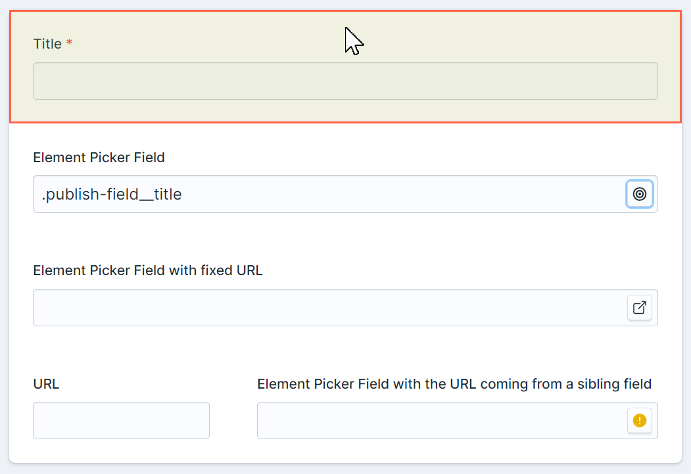
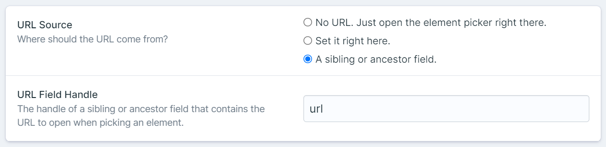

# Statamic Element Picker

A Statamic plugin that adds an Element Picker Fieldtype. <br>
Pick an element and get its short and unique "CSS selector".



## Installation

Install this plugin using composer.

```cli
composer require eminos/statamic-element-picker
```

## Features

- Pick an element right on that page or a configurable URL.
- Configure where the URL is coming from.
  - Set the URL in the field config.
  - Let the URL come from a sibling or ancestor field (works inside Grids or Replicators as well).
- If you choose to use a URL a new window will open with that URL where you can pick your element with a click.
- Saves a short and unique "CSS selector" for that element which you can use to find the element again (uses [finder](https://github.com/antonmedv/finder) under the hood).

### Here's a screenshot of the config options.



## Known limitations

- The URL must be the same origin as the page where the Element Picker is loaded. In other words you can only pick an element from the same domain as the control panel. This is because of the security in how messaging between open windows/tabs work. There might be a workaround involving Shadow DOM or similar.

## Possible improvements

- Option to set the URL right on the Element Picker field itself. This can optionally get saved together with the CSS selector string.
- Configurable CSS selector generation / [finder](https://github.com/antonmedv/finder).
- Configurable inspector design, background color, border, etc.

## License

The MIT License (MIT). Please see [License File](LICENSE.md) for more information.